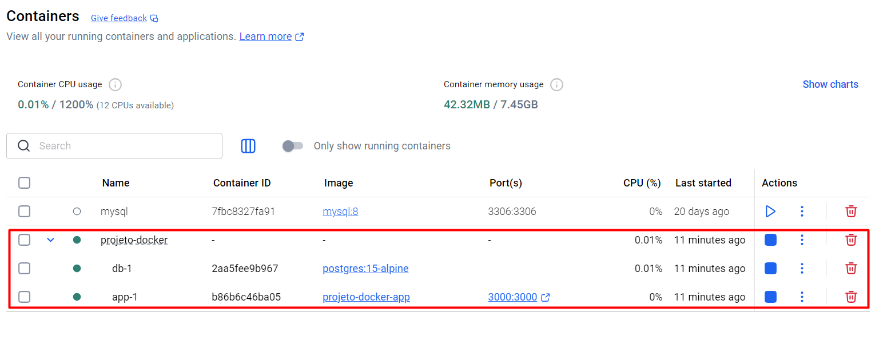
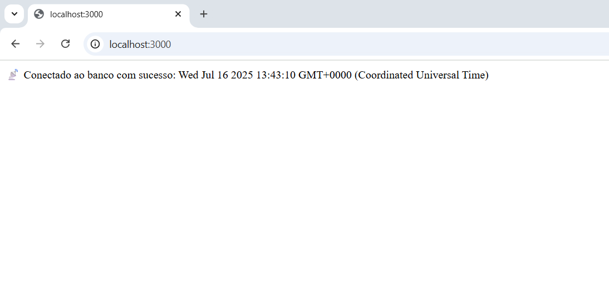

# 🐳 Secure Application with Docker + PostgreSQL

Sample project following best practices:

✅ Multi-stage Dockerfile  
✅ Database with a restricted-access user  
✅ Externalized sensitive environment variables  
✅ Persistent volumes  
✅ Isolated Docker network

## 🔧 Prerequisites

- Docker and Docker Compose
- Bash or a compatible terminal
- `.env` file created from `.env.example`

## 🚀 How to start

```bash
docker-compose up --build

## ✅ Expected result

<br>

